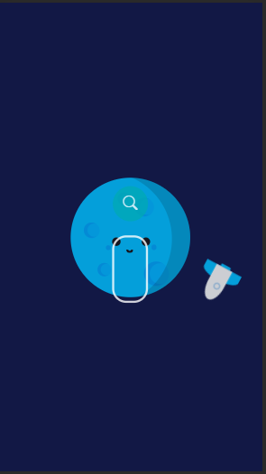
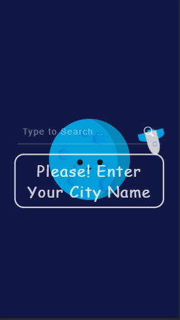
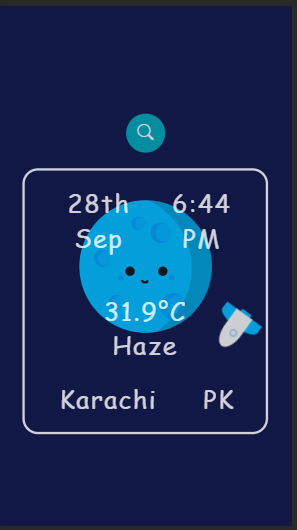
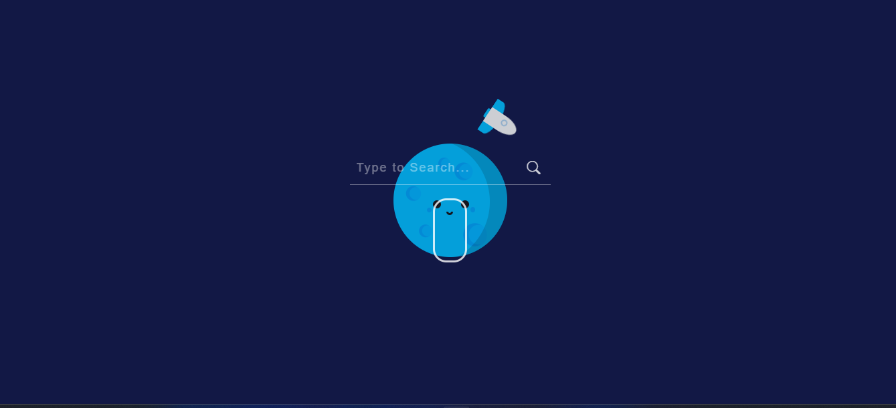
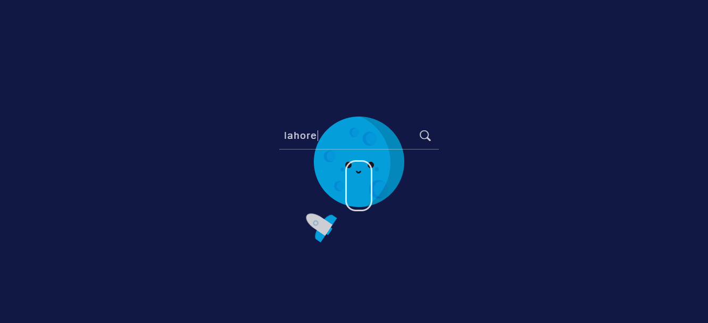
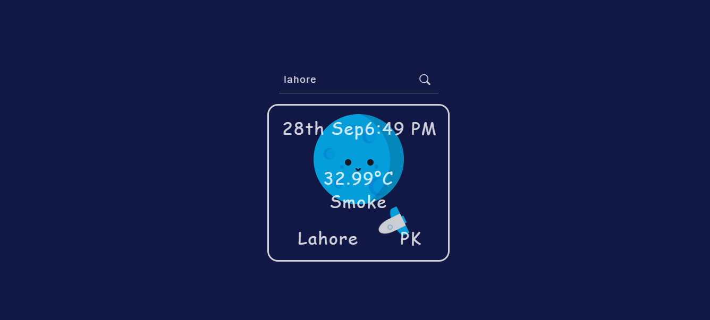

# Weather App

<a href="https://huzaifanizam.github.io/BMI-CalculaterwithInputandOutput/" target="blank">Weather App</a>

- 📫 How to reach me **nizamhuzaifa@gmail.com**

<h3 align="left">Connect with me:</h3>

## For my purpus
